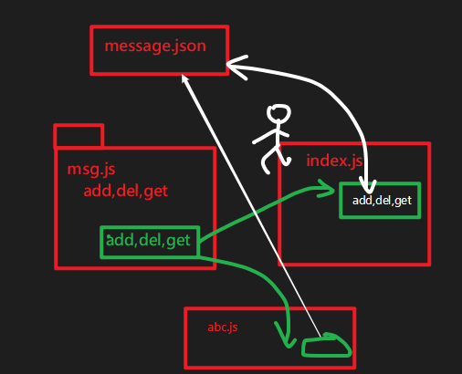

2020-02-11

## 复习 

### nodejs的作用

能够运行js代码 ；

充当服务器（后端）；

### nodejs运行js代码的两种方式

- REPL
- node 文件路径
  - 相对路径 (相对于当前的小黑窗，要运行js文件的位置)  `node ./a/b.js` 
  - 绝对路径 `node D:\94\server94\code\nodejs\01.js`

### 能够说出\__dirname 和 __filename的作用

全局变量：获取 当前的文件夹和文件的绝对路径。

### fs模块

它是一个核心模块，用来做文件处理。

两种版本的代码:

- 同步方法 readFileSync
- 异步方法 readFile

### path模块

它是一个核心模块，用来处理路径

- path.join()

## 模块

看起来就一个js文件；

定义这个模块（js文件）是为了在其它模块（js文件）中去使用；

- 在es6之前，js是不支持模块化的（不能在一个js文件中去引入另一个js文件）
- 在es6中是支持的。
- 在nodejs这个环境中也支持的。

## 使用自定义模块

1.定义模块。最重要是在文件中使用module.exports = 要导出的东西

2.导入模块。const XXX = require('./相对路径')

 -  只用是核心模块，或者是第三方模块时，才不需要加./。

## 应用

