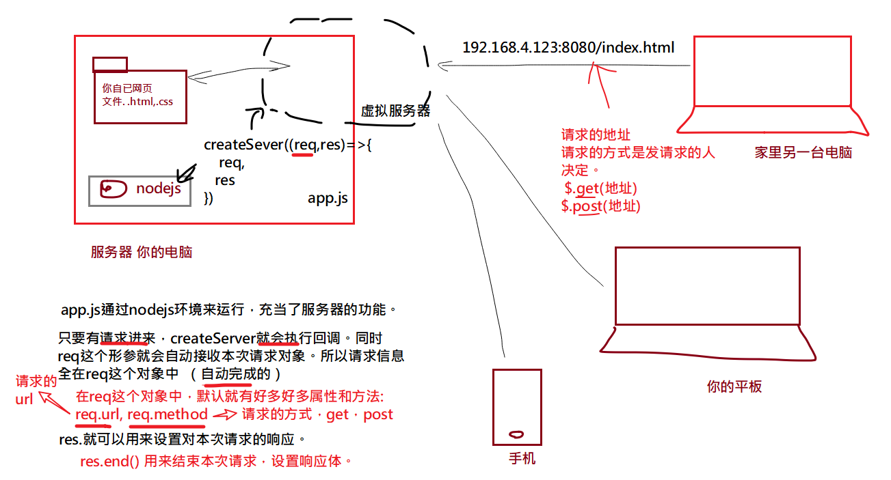
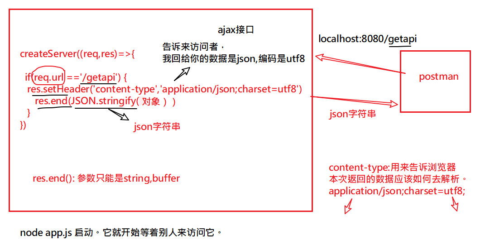
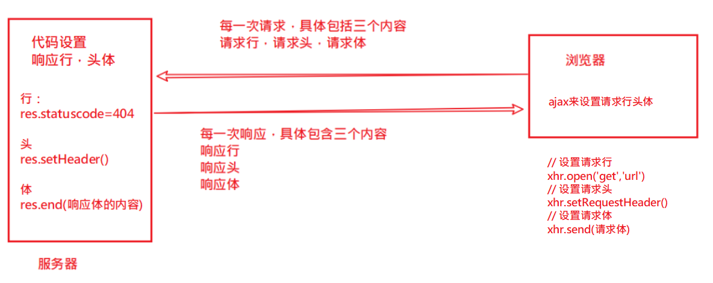
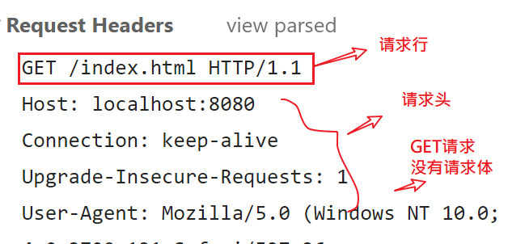
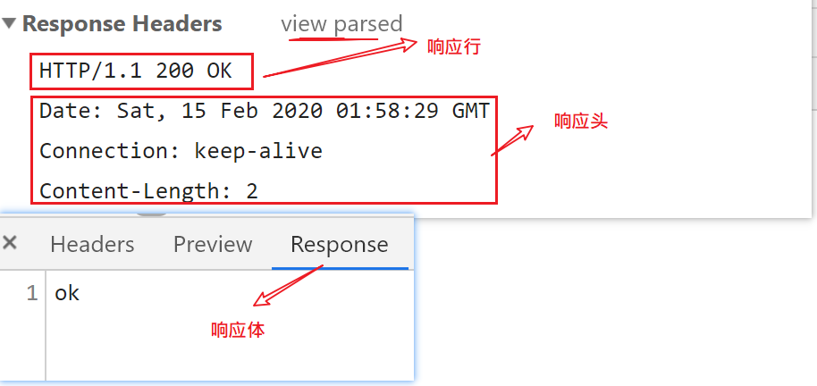

每日反馈

| 姓名   | 意见或建议                                                   |
| ------ | ------------------------------------------------------------ |
| ***    | 知识量有点大，脑子不够用了，怎么办。`自已总结一下，不是所有都要背下来` |
| 秦李天 | 老师，您能在用一个知识点，属性，方法以前，先讲一下它咋用或者是怎末产生的吗？是实话我这两天的课听的有点差劲，我感觉班上不是我一个人这样的状态。`能不能具体一点` |
| 王际霖 | 核心模块 的 一些方法 记得 还是有些 混乱 望高人 出谋划策      |

整体复习一下


nodejs

- 当服务器：让你的网页能够被其他人访问。
- 写接口：让ajax的请求到这里来。





get不带参数




## 请求与响应



一个典型的请求与响应：






## nodejs设置响应 行头体

```javascript
const http = require('http')

const server = http.createServer((req,res)=>{
    // 响应行： HTTP/1.1 状态码 状态码的说明
    res.statusCode = 404;

    // 响应头：
    // 理解成一个对象，其中有很多键值对，每一个都表示不同的含义。
    // content-type:告诉浏览器，本次响应体中的内容是html,并且是utf8编码的
    res.setHeader("content-type","text/html;charset=utf8")
    
    // 响应体:给请求带回去的核心内容。
    // 设置响应体  res.end("响应体")
    res.end("<h1>大家好</h1>")
})

//  第一个参数是端口号.可以自已定义
//  第二个参数是一个回调，表示当前端口监听成功时，它会执行
server.listen(8080,()=>{
    console.log("服务器已经启动");
})
```


## ajax设置请求 行头体

```javascript
var xhr = new XMLHttpRequest(); 
// xhr.open: 请求的url地址，就是请求行的一部分
xhr.open("post","http://localhost:8080/getapi");
// 设置请求头
xhr.setRequestHeader("content-type","application/x-www-form-urlencoded")

// 设置请求体
// 请求体用来包含本次请求要传递给后端服务器的数据。
xhr.send("a=1&b=2")
```

## express框架 初体验

- 它是基于nodejs的第三方模块
- 要使用npm 来安装
- 它是对http模块的增强

```javascript
// 引入 第三方模块 
const express = require('express')

// 创建express实例
const server = express()

// req,res和http模块中的一样
// 只是，express框架增强它们的功能
// res.send() 就是express 给res提供的新方法
//  相比res.end()它可以直接传入对象，并自动设置响应头。

// 如果有请求 '/' 路径，则执行后面的回调函数。
server.get('/', (req, res) => {
    // req对象中保存本次请求的所有信息
    console.log('有人访问了',req.url)
    res.end('Hello World!')
    // res.end({"a":1})
    // res.send({"a":1})
})

// 如果有请求 '/abc' 路径，则执行后面的回调函数。
server.get('/abc', (req, res) => {
    // req对象中保存本次请求的所有信息
    console.log('有人访问了',req.url)
    // res.end('Hello World!')
    // res.end({"a":1})
    res.send({"a":1})
})

// 开启服务，监听端口 300
// 服务器启动成功，则输出
server.listen(3000, () => console.log('Example app listening on port 3000!'))

```


## 托管静态资源

目标：让指定文件夹下的所有文件都可以直接访问

格式：

```javascript
// 不需要加前缀： localhost:8080/xxx.html
server.use( express.static("pyg") )

// 需要加前缀： localhost:8080/pyg/xxx.html
server.use('/pyg', express.static("pyg") )
```

示例

```jav
const express = require('express')

// 创建一个express实例
const server = express();

// 就这一句，就可以实现 访问静态资源
// express.static("要托管的文件夹")
// 在这个文件夹下的所有的静态资源都可以直接访问
// server.use( express.static("pyg") )
server.use("/pyg", express.static("pyg") )

// 让web02目录下的文件也可以直接访问
server.use( express.static("web02") )


server.listen(8080,()=>{
    console.log("express服务器已经在8080端口，准备好了");
    
})

```


## 路由

作用：决定 当以什么方式收到什么路径的请求时，做什么事。

格式：

```javascript
 app.请求方式（"请求路径",(req,res)=>{
     // req就是本次请求对象
     // res就是本次响应对象
     
 }）
```

写接口

```javascript
// 路由： 请求的方式是get,请求的路径是 /abc, 回调函数是(req,res)=>{}
app1.get("/abc",(req,res)=>{
    res.send("ok")  
})


app1.post("/abc",(req,res)=>{
    // res.send("post-abc")  
    res.send({code:200,data:[1,2,3]})  
})
```

