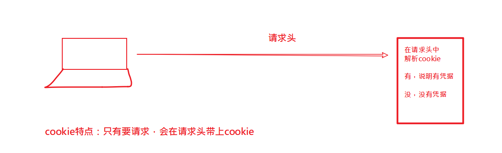
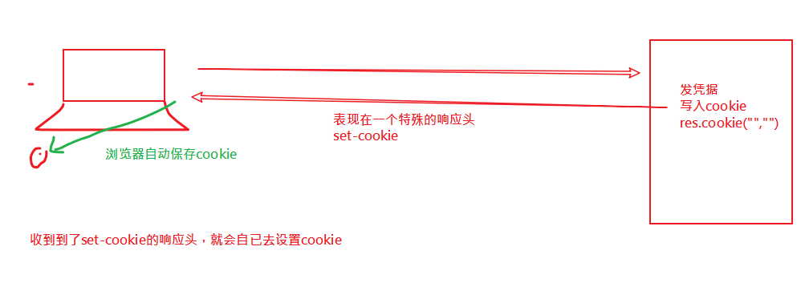

## 每日反馈

| 姓名 | 意见或建议                                                   |
| ---- | ------------------------------------------------------------ |
| ***  | 老师，你在电脑上操作的时候慢一点，因为直播，看着太快了。反应不过来。 |
| ***  | 老师能不能再说一下 用express 时 Post请求要怎么配置 上传文件时要怎么配置 代码里面分开写了 有点弄不清 |
| ***  | 您讲的知识太多也太快，真的消化不良了。 有些新知识刚讲一下就立刻使用，用完就继续学习新的知识然后再使用，反反复复，最后还得把今天甚至这几天学的新知识都结合起来做一下案例实操，原谅我实在做不到啊。 有时感觉像是坐在电脑前监督你给我们录视频一样，现在班里有基础的同学跟零基础的小白听起课来完全是两个世界了。 一天全部都是讲课，等一天课程结束，到晚上，自己打开电脑都不知道从哪儿开始，该做什么，是看讲义、视频、还是怎么样？完全无所适从。`1.思维导图 2.讲义快速过一遍。3.写代码。3.1看我给你们的代码，写注释。每一句代码做什么事；3.2  2倍速度，发视频，对着写。自已再写一次：边写边看。 3.3独立完成。` |
| ***  | 感觉自己就是欠练，唉                                         |


post接口 普通键值对

```javascript
const bodyParser = require('body-parser');
app1.use(bodyParser.urlencoded({extended:false}));
// 实现一个接口： post 
// url: /api/post,支持传入任何参数普通键值对
// 返回值：收到的参数

app1.post("/api/post",(req,res)=>{
    // 如何获取传过来的参数？
    // 需要两步：
    // 1.引入bodyparser
    // 2.在req.body上获取参数
    console.log(req.body);
    

    // res.send("post-abc")  
    res.send(req.body)  
})
```


post接口 JSON

```javascript
const bodyParser = require('body-parser');
app1.use(bodyParser.json())
app1.post("/api/postJSON",(req,res)=>{
    // 如何获取传过来的参数？
    // 需要两步：
    // 1.引入bodyparser
    // 2.在req.body上获取参数
    console.log(req.body);
    

    // res.send("post-abc")  
    res.send(req.body)  
})
```


post formdata

```javascript
// 1. 引入
// multer用来处理文件上传的接口(发布文章：封面图像,标题....)
const multer = require('multer');

// 2. 配置
const upload = multer({dest:'uploads/'}) // 
// 自动放到这个文件夹中，如果文件没有创建，则multer自动创建。

app1.post("/api/upload",upload.single("cover"),(req,res)=>{

    // 当前这个文件的信息保存在req.file属性中。
    console.log(req.file);

    // req.body 保存那些个不是文件的参数信息
    console.log(req.body);
    
    res.send("ok")
})
```


## 会话

> 服务器问你的身份？ 你是谁？
>
> 思路：
>
> 1. 访问一个登陆页，成功之后，服务器给一个**凭据**保存到浏览器 。 （前台交钱，给你卡）
> 2. 浏览器拿着这个**凭据**去访问主页。（拿卡找tony老师）
> 3. 主页收到请求之后，检查**凭据**。（tony老师检查）


实现会话技术

- cookie（了解）

- session（推荐）


## cookie

服务器向浏览器上写入的凭据，这个凭据表现为cookie。

一旦浏览器中有这个凭据(cookie)，则下一次请求**本网站**上的页面时，会**自动**带上：具体是在一个叫cookie的请求头中。


写入cookie(服务器向浏览器写入cookie)

​	核心是设置一个名字为set-cookie的响应头；

获取cookie（服务器获取本次请求的cookie）

	- req.headers.cookie 。但它不好看，是一长长的字符串，需要进一步解析
	- 额外安装包：cookie-parser

删除cookie

​	res.clearCookie('cookie名')

设置有效期：

​	// 给cookie设置有效期。

   // 如果超过了这个时间，则cookie会自动爆炸（自已消失）

   // expires: 日期格式。

   // new Date(Date.now() + 1000*10) 表示10s之后的时间

 ```javascript
res.cookie('salary', '20000', { expires: new Date(Date.now() + 1000*10) })
 ```


## cookie身份验证






## session

是基于cookie的。它与cookie的区别在于：

- 它不是把真实凭证信息放在浏览器，而只是放了一把钥匙（cookie就是钥匙），真实数据放在服务器。
- 收到请求，解析出来钥匙(cookie),再用钥匙去服务器中找出数据。


## 实践

1. 安装express ,express-session

2. 配置

   固定写法，在官网上参考

3. 使用
   1. 设置session 。 req.session.属性名 = 属性值；
   2. 获取session。  req.session.属性名
   3. 销毁session。req.session.destory()

## session vs cookie

cookie原理：

- 从服务器端向客户端浏览器留下信息`设置响应头：set-cookie`；
- 浏览器每次访问服务器时都带上这些信息(自动携带cookie是浏览器的特点)；

session原理：

- 服务器端会为每个用户（浏览器）各自保存一个session（文件）。当服务器保存session之后，会以cookie的形式告诉浏览器，你的session编号是哪一个。它把session编号返回给了浏览器(cookie是session编号)，而把真实的数据保存在服务器。
- 下次再来访问服务器的时候，浏览器就会带着它自己的session编号（cookie）去访问，服务器根据session号就可以找到对应的session了。

cookie：优点是节省服务器空间，缺点不安全。不要保存敏感信息。

session：优点是安全，缺点需要服务器空间， 是一种最常见的解决方案。