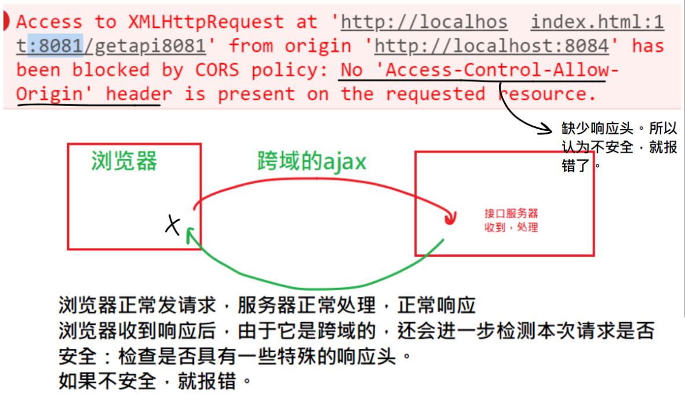
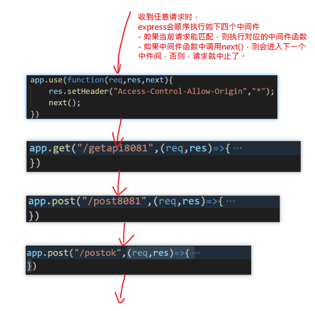
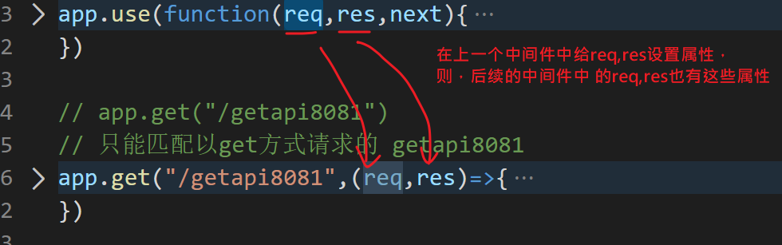

## 反馈

| 姓名 | 意见或建议                                                   |
| ---- | ------------------------------------------------------------ |
| ***  | session包里面的req.session.isLogin = true;是固定写法吗? `不是。 req.session是一个对象，我们可以向其中添加任何属性及属性值。这个过程就是设置session，理论上，你可以按你自已的需求给req.session设置任意多个你想要保存在服务器端的数据{isLogin:true}，而它也只会把sesssionId(钥匙)通过cookie写回给浏览器。` |
| ***  | Node.js阶段 没什么大问题 就是多敲多练的活 但是！我们是作什么的 还是要分清 "主次" 呦 不要太沉迷Node。js( ⓛ ω ⓛ *)`不错，有大局观！` |
| ***  | 可能是最后一次为凡老师写反馈了,感觉老师为我们的学习费了很多心,老师辛苦了,谢谢老师`谢谢，我 好人为师 ` |
| ***  | 老师，万分感谢~~~~~ 疫情后，再相逢，请你吃大龙虾~~~          |
| ***  | 对jsonp的原理理解不到位                                      |
| ***  | 感觉练习的时候不够啊`时间 与 效率 成反比`                    |
| ***  | 非常想问您问题，可是又不知道能问什么，知识点模模糊糊的， 说不会吧，也会，说会吧，又不太清楚，怎么破？`写。 写代码。 session留言板，写一遍，遇到问题再问！` |
| ***  | 基础不好 请老师推荐案例和重要知识点对以后找工作或实际工作有帮助的 像nodejs这种是不是不要把重心放在这上面 毕竟是前端 谢谢`nodejs要掌握：1.它是其它后续学习 vue框架的 工具基础。后续要学习内容都是基于nodejs的。2.会用它写接口 （未雨绸缪） 3.服务器的基础概念：ip,端口，session,跨域....` |
| ***  | 下午第一节课多提问一下吧 感觉容易犯困 最后一节课多总结一下呗 注释能多写点还是多写点吧 这么辛苦什么时候给老师加薪呀 |
| ***  | 加油＾０＾~                                                  |

## 复习jsonp

为解决ajax跨域。不同源就是跨域。同源是： 发起ajax的页面的地址 与 接口地址 要在： 协议，域名，端口要相同。

jsonp不是ajax请求，所以，它不会有ajax跨域问题。

原理：

- 前端 
  - script标签，请求 接口地址。它会把收到的响应体当作js代码来执行。
  - 准备一个回调函数。例如:`fn()`
- 后端
  - 在接口的响应体中，返回一个 标准的js 函数调用语句 ，例如：`res.send('fn(12345)')`

实践：

- jquery的实现 

  ​	`dataType:"jsonp"`

  ```javascript
  $("#btnGet8080").click(function(){
      // 跨域的
      $.ajax({
          url:"http://localhost:8080/getapi8080",
          type:'get',
          dataType:"jsonp" /*以jsonp的方式去请求*/
      }).then(function(res){
  
      })
  
  })
  ```

  

## cors

跨域真正错误：缺少需要的响应头!

跨域ajax，浏览器可以正常发出请求，服务器可以正常收到请求，并做出响应；但在浏览器收到服务器的响应后，由于它是跨域的，所以要进一步检查这个请求是否安全：就是看有没有特殊的响应头`access-control-allow-origin`，如果没有，就会解析响应回来的内容，并报错。



解决方案，就是在服务端做出响应时，补充一个特殊的**响应头**。

```javascript
app.get("/getapi8081",(req,res)=>{
	
    // 设置响应头
    res.setHeader("Access-Control-Allow-Origin","*");

    console.log('收到请求')
    res.json({
        code:200
    })
})
```


## cors与jsonp对比

- cors
  - 可以处理所有的请求类型：get,post,..... ; 
  - 它有浏览器的限制；
  - 它只要改后端代码(加响应头)，**前端不做任何改动**。

- jsonp
  - 只能处理get；          
  - 没有浏览器的限制；
  - 要改后端代码(res.jsonp)，前端要改(dataType:"jsonp")。


## express中的中间件技术

中间件技术是express框架的一个重要的特点。

它的思路是：把一个一个处理流程抽出来， 写在函数中，形成一个串，依次执行流程。


中间件的格式是：

```javascript
app.use(中间件)
// 接口本质也是中间件
app.get("/xx",中间件)
app.post("/xx",中间件)
```



app.use(function(req,res,next){

  console.log("看门大哥",req.url);

  req.abc= "10086"

  // 所有后续的中间件中的res就具有这个特殊的响应头

  res.setHeader("Access-Control-Allow-Origin","*");

  next();

  // 如果一个中间件函数中，

  // 既没有next()，： 跳出当前中间件，执行下一个中间件

  // 也没有res.end(),res.send(),res.json()

  // 整体请求就得不到响应，浏览器一直处于等待状态。

})的执行顺序

- 按书写顺序，从上到下

- 遇到中间件，匹配一下。

  - app.use() 全匹配。只要有请求，它就能匹配
  - app.get('/xxxx') 。只能匹配get方式求的/xxxx路径。

- 匹配成功要执行中间件函数

  - 遇到了next() ，则跳了当前中间件，进入下一个中间件
  - 遇到了res.end(),res.send(),res.json() 结束本次请求。后续中间件不执行
  - 如果上面两都没有，则整个请求就卡这个中间件中，浏览器就一直处于pending

  

## 中间件中req,res,具有向后的传递性

- 中间件的req,res是向后共享的：上面的中间件设置了，下面的中间件就可以使用




## cors方案的优化

用中间件技术，在所有的接口之前，添加一个app.use()中间件

```javascript
app.use(function(req,res,next){
    // 所有后续的中间件中的res就具有这个特殊的响应头
    res.setHeader("Access-Control-Allow-Origin","*");
    next();
    // 如果一个中间件函数中，
    // 既没有next()，： 跳出当前中间件，执行下一个中间件
    // 也没有res.end(),res.send(),res.json()
    // 整体请求就得不到响应，浏览器一直处于等待状态。
})
```


